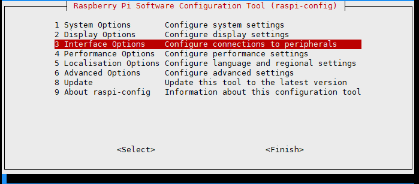
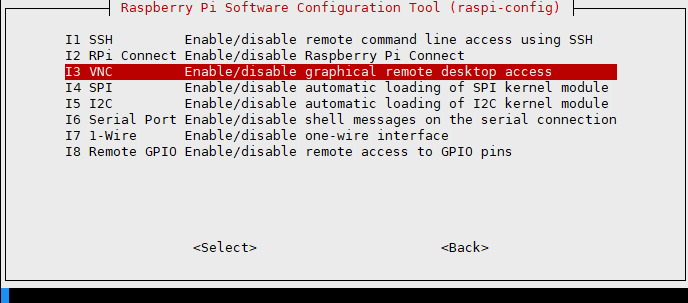
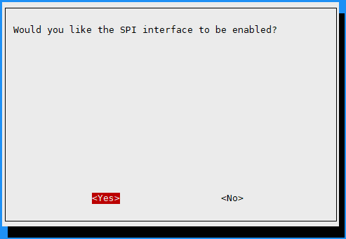
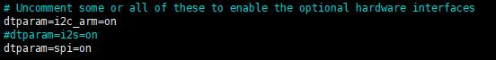

.. _raspberrypi:

Raspberry Pi User Guide
========================

Hardware Connection
---------------------

When connecting to the Raspberry Pi, you can directly insert the board into the 40PIN header of the Raspberry Pi, making sure the pins are correctly aligned.

If you choose to connect using an 8-pin cable, please refer to the pin correspondence table below:

.. list-table:: Pin Correspondence Table
   :header-rows: 1
   :widths: 20 40 40

   * - e-Paper
     - Raspberry Pi BCM2835
     - Raspberry Pi Board
   * - VCC
     - 3.3V
     - 3.3V
   * - GND
     - GND
     - GND
   * - DIN
     - MOSI
     - 19
   * - CLK
     - SCLK
     - 23
   * - CS
     - CE0
     - 24
   * - DC
     - 25
     - 22
   * - RST
     - 17
     - 11
   * - BUSY
     - 24
     - 18

Enable SPI Interface
-------------------------

Open the Raspberry Pi terminal and enter the following command in the configuration interface:

.. code-block:: bash

    sudo raspi-config
    # Select Interfacing Options -> SPI -> Yes Enable SPI interface

Then restart your Raspberry Pi:

.. code-block:: bash

    sudo reboot now

Check the /boot/config.txt file or /boot/firmware/config.txt file to ensure the SPI interface is enabled:

.. code-block:: bash

    sudo cat /boot/config.txt
    # Or for newer systems
    sudo cat /boot/firmware/config.txt

C Language
-----------

Install lg Library
^^^^^^^^^^^^^^^^^^^^^^

.. code-block:: bash

    # Open the Raspberry Pi terminal and run the following commands:
    wget https://github.com/joan2937/lg/archive/master.zip
    unzip master.zip
    cd lg-master
    make
    sudo make install
    # For more details, refer to the source code: https://github.com/gpiozero/lg

Install gpiod Library (Optional)
^^^^^^^^^^^^^^^^^^^^^^^^^^^^^^^^

.. code-block:: bash

    # Open the Raspberry Pi terminal and run the following commands:
    sudo apt-get update
    sudo apt install gpiod libgpiod-dev

Install BCM2835 (Optional)
^^^^^^^^^^^^^^^^^^^^^^^^^^^

.. code-block:: bash

    # Open the Raspberry Pi terminal and run the following commands:
    wget http://www.airspayce.com/mikem/bcm2835/bcm2835-1.71.tar.gz
    tar zxvf bcm2835-1.71.tar.gz
    cd bcm2835-1.71/
    sudo ./configure && sudo make && sudo make check && sudo make install
    # For more information, refer to the official website: http://www.airspayce.com/mikem/bcm2835/

Install WiringPi (Optional)
^^^^^^^^^^^^^^^^^^^^^^^^^^^

.. code-block:: bash

    # Open the Raspberry Pi terminal and run the following command:
    sudo apt-get install wiringpi
    
    # For Raspberry Pi systems after May 2019 (earlier systems may not need this), you may need to upgrade:
    wget https://project-downloads.drogon.net/wiringpi-latest.deb
    sudo dpkg -i wiringpi-latest.deb
    gpio -v
    # Running gpio -v should display version 2.52. If not shown, the installation is incorrect.
    
    # For Bullseye branch systems, use the following commands:
    git clone https://github.com/WiringPi/WiringPi
    cd WiringPi
    ./build
    gpio -v
    # Running gpio -v should display version 2.60. If not shown, the installation is incorrect.

Download Demo Code
^^^^^^^^^^^^^^^^^^^^^^^^^^^

.. code-block:: bash

    # If you have already downloaded it, you can skip this step
    git clone https://github.com/lafvintech/LAFVIN-2.13inch-ePaper-HAT.git
    cd e-Paper/RaspberryPi/

Compile the Demo Program
^^^^^^^^^^^^^^^^^^^^^^^^^^^

.. note::
    -j4 indicates compilation using 4 threads, the number can be modified as needed;
    EPD=epd2in13V4 is used to specify a macro definition, epd2in13V4 corresponds to the test demo in the main function.

.. code-block:: bash

    cd c
    sudo make clean
    sudo make -j4 EPD=epd2in13V4

Run the Demo Program
^^^^^^^^^^^^^^^^^^^^^^^^^^^

.. code-block:: bash

    sudo ./epd

Python
---------

Install Libraries for Python 3
^^^^^^^^^^^^^^^^^^^^^^^^^^^^^^^^^^

.. code-block:: bash

    sudo apt-get update
    sudo apt-get install python3-pip
    sudo apt-get install python3-pil
    sudo apt-get install python3-numpy
    sudo pip3 install spidev(Optional) # 可以先不安装，如果运行时报错，再安装

Install Libraries for Python 2
^^^^^^^^^^^^^^^^^^^^^^^^^^^^^^^^^^

.. code-block:: bash

    sudo apt-get update
    sudo apt-get install python-pip
    sudo apt-get install python-pil
    sudo apt-get install python-numpy
    sudo pip install spidev (Optional) # 可以先不安装，如果运行时报错，再安装

Install gpiozero Library
^^^^^^^^^^^^^^^^^^^^^^^^^^^^^^^^

.. note::
    This library is installed by default in the system. If not, you can install it using the following commands

.. code-block:: bash

    sudo apt-get update
    # Python 3
    sudo apt install python3-gpiozero
    # Python 2
    sudo apt install python-gpiozero

Download Demo Code
^^^^^^^^^^^^^^^^^^

.. code-block:: bash

    # If you have already downloaded it, you can skip this step
    git clone https://github.com/lafvintech/LAFVIN-2.13inch-ePaper-HAT.git
    cd e-Paper/RaspberryPi/python

Run the Demo Program
^^^^^^^^^^^^^^^^^^^^^^^^^^^

.. code-block:: bash

    sudo python3 epd2in13v4_test.py

.. _unzip_code:

.. note::
    If you cannot download the code from GitHub, you can use the following commands to download the zip file, then extract it. Other operations remain the same as above:
    
    .. code-block:: bash
    
        wget 
        unzip .zip
        cd 
