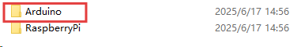
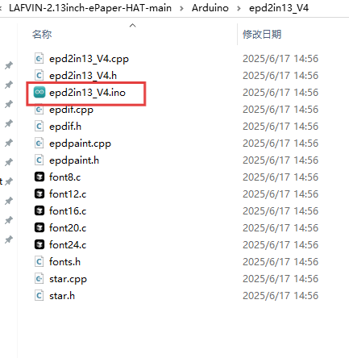
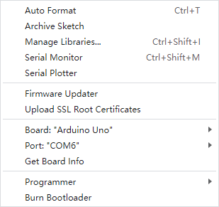
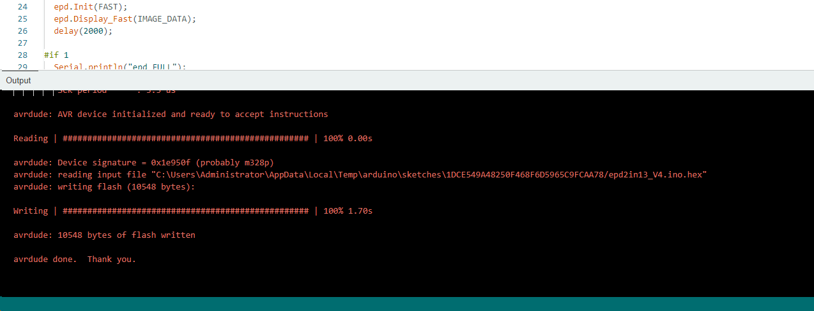

.. _arduino:

Working With Arduino
======================

Hardware Connection
---------------------

Use an 8PIN cable to connect, please refer to the pin correspondence table below:

.. list-table:: Pin Correspondence Table
   :header-rows: 1
   :widths: 20 40 40
   :class: longtable

   * - e-Paper
     - Arduino UNO
     - Mega2560
   * - VCC
     - 5V
     - 5V
   * - GND
     - GND
     - GND
   * - DIN
     - D11
     - D51
   * - CLK
     - D13
     - D52
   * - CS
     - D10
     - D10
   * - DC
     - D9
     - D9
   * - RST
     - D8
     - D8
   * - BUSY
     - D7
     - D7

Install Arduino IDE
---------------------

You can refer to this tutorial to install Arduino IDE:

:ref:`install_arduino_ide` 

Run The Demo
--------------

Download the code by clicking this link: https://codeload.github.com/lafvintech/LAFVIN-2.13inch-ePaper-HAT/zip/refs/heads/main

After downloading and extracting the files, navigate to the Arduino folder where you'll find the example programs:

   
   *Arduino Example Folder*

Open the epd2in13_V4.ino file:

   
   *Opening the Example File*

Select the corresponding Board and Port in the Tools menu of the Arduino IDE:

   
   *Selecting Board and Port*

Finally, click upload. A successful upload will look like this (Arduino 2.3.2):

   
   *Successful Upload*

After uploading, you will see the example program patterns displayed on your e-Paper screen.

.. raw:: html

   
