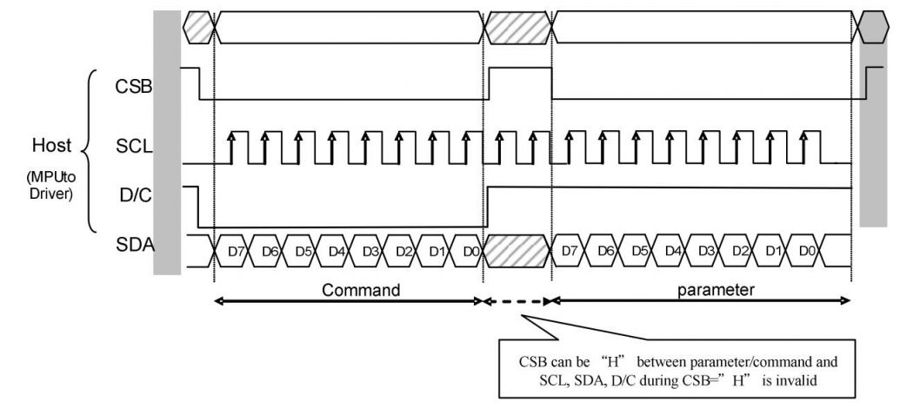
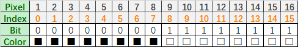
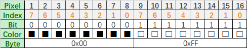

.. _about_this_kit:

About This Kit
====================

LAFVIN 2.13Inch e-Paper HAT
-------------------------------

.. figure:: ./Tutorial/img/main.jpg
   :align: center
   :width: 80%

   *LAFVIN 2.13Inch e-Paper HAT*

Introduction
---------------

This is 2.13inch E-Ink display HAT with Raspberry Pi 40PIN GPIO extension header, compatible with Raspberry Pi series boards.   250x122 resolution, Black and White Two Display colors, with embedded controller, communicating via SPI interface, supports partial refresh.

No backlight, keeps displaying last content for a long time even when power down.    Ultra low power consumption, basically power is only required for refreshing.

SPI interface, for connecting with controller boards likeArduino/ESP32, etc.    Onboard voltage translator, compatible with 3.3V / 5V MCUs.

Comes with online development resources and manual (driver board circuit diagram, examples for Raspberry Pi)

Parameters
--------------

.. list-table:: 
   :header-rows: 1
   :widths: 40 60
   :class: longtable

   * - Parameter
     - Specification
   * - Screen size
     - 2.13inch
   * - Driver board dimensions
     - 69*30mm
   * - Display dimensions
     - 48.55mm × 23.71mm
   * - Outline dimensions(screen only)
     - 59.2mm × 29.2mm × 1.05mm
   * - Operating voltage
     - 3.3V/5V(5V is required for power supply and signal)
   * - Communication interface
     - SPI
   * - Dot pitch
     - 0.194mm × 0.194mm
   * - Resolution
     - 250 x 122
   * - Display color
     - Black, white
   * - Grey scale
     - 2
   * - Refresh time
     - 2s
   * - Refresh power
     - 26.4mW (typ.)
   * - Standby current
     - < 0.01uA (almost none)
   * - Operating temperature
     - 0 ~ 50 ℃
   * - Storage temperature
     - -25 ~ 70 ℃

.. note::

    - **Refresh time**: The refresh time is the experimental results, the actual refresh time will have errors, and the actual effect shall prevail. There will be a flickering effect during the global refresh process, this is a normal phenomenon.
          
    - **Refresh power consumption**: The power consumption data is the experimental results. The actual power consumption will have a certain error due to the existence of the driver board and the actual use situation. The actual effect shall prevail.
          
    - **Low temperature operation**: Refresh in a low temperature environment may appear color cast, it need to be static in the environment of 25℃ for 6 hours before refresh.

Communication Protocol
-----------------------

   
   *SPI Communication Interface*

- **CSB (CS)**: Slave chip select signal, active at low level. When it is at low level, the chip is enabled.
- **SCL (SCK/SCLK)**: Serial clock signal.
- **D/C (DC)**: Data/command control signal, write command (Command) when the level is low; write data (Data/parameter) when the level is high.
- **SDA (DIN)**: Serial data signal.
- **Timing**: CPHL=0, CPOL=0, i.e. SPI mode 0.

Note: For specific information about SPI communication, you can search for information online on your own.

Working Principle
--------------------

The e-paper used in this product uses "microcapsule electrophoresis display" technology for image display. The basic principle is that charged nanoparticles suspended in a liquid migrate under the action of an electric field. The e-paper display screen displays patterns by reflecting ambient light and does not require a backlight. Under ambient light, the e-paper display screen is clearly visible, with a viewing angle of almost 180°. Therefore, e-paper displays are ideal for reading.

Program Principle
--------------------

- We define the pixels in a monochrome picture, 0 is black and 1 is white.
      
  - White: □, Bit 1
        
  - Black: ■, Bit 0
        
- The dot in the figure is called a pixel. As we know, 1 and 0 are used to define the color, therefore we can use one bit to define the color of one pixel, and 1 byte = 8 pixels
      
- For example, If we set the first 8 pixels to black and the last 8 pixels to white, we show it by codes, they will be 16 bit as below:
      

   
   *Pixel Representation Example*

- For computer, the data is saved in MSB format:
      

   
   *MSB Data Format*

So we can use two bytes for 16 pixels.

Precautions
------------

.. role:: red
   :class: red

1. :red:`Partial Refresh Limitation: For e-Paper displays that support partial refresh, please note that you cannot refresh them with the partial refresh mode all the time. After refreshing partially several times, you need to fully refresh EPD once. Otherwise, the display effect will be abnormal, which cannot be repaired!`

2. :red:`Power Management: Note that the screen cannot be powered on for a long time. When the screen is not refreshed, please set the screen to sleep mode or power off it. Otherwise, the screen will remain in a high voltage state for a long time, which will damage the e-Paper and cannot be repaired!`

3. :red:`Refresh Intervals: When using the e-Paper display, it is recommended that the refresh interval is at least 180s, and refresh at least once every 24 hours. If the e-Paper is not used for a long time, you should use the program to clear the screen before storing it. (Refer to the datasheet for specific storage environment requirements.)`

4. **Sleep Mode**: After the screen enters sleep mode, the sent image data will be ignored, and it can be refreshed normally only after initializing again.
      
5. **Border Color Adjustment**: Control the 0x3C or 0x50 (refer to the datasheet for details) register to adjust the border color. In the demo, you can adjust the Border Waveform Control register or VCOM AND DATA INTERVAL SETTING to set the border.
      
6. **Image Display Issues**: If you find that the created image data is displayed incorrectly on the screen, it is recommended to check whether the image size setting is correct, change the width and height settings of the image and try again.
      
7. **Voltage Compatibility**: The working voltage of the e-Paper display is 3.3V. If you buy the raw panel, you need to add a level convert circuit for compatibility with 5V voltage. The new version of the driver board (V2.1 and subsequent versions) has been added a level processing circuit, which can support both 3.3V and 5V. The old version only supports a 3.3V working environment. You can confirm the version before using it. (The one with the 20-pin chip on the PCB is generally the new version. And the version number is under the board name.)
      
8. :red:`Cable Handling: The FPC cable of the screen is fragile, Please note: Do not bend the cable along the vertical direction of the screen to avoid tearing the cable; Do not repeatedly excessive bending line to avoid line fracture; Do not bend the cable toward the front of the screen to prevent the cable from being disconnected from the panel. It is recommended to use after fixing the cable during debugging and development.`

9. :red:`Screen Fragility: The screen of e-Paper is relatively fragile, please try to avoid dropping, bumping and pressing hard.`

10. **Testing Recommendation**: We recommend that customers use the sample program provided by us to test with the corresponding development board.

.. raw:: html

   
